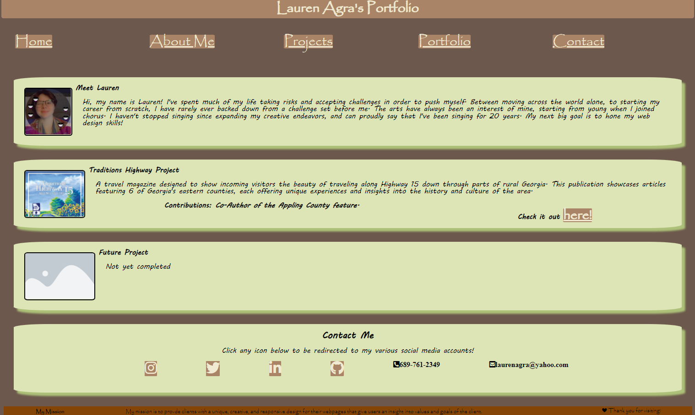

# Portfolio-Base

## This project was built in order to begin preparing my professional portfolio. As I progress as a coder and developer, I will be adding and changing the overall design to accommodate new knowledge and skills. 

-My biggest motivator in creating this is the practice and usage of skills as I learn. I want to be able to create a responsive, beautiful webpage, and there's no better place to practice than on your own materials! 

-I wanted people to be able to interact with my page, particularly with the scrolling feature of my nav bar, and the contact information links at the bottom. During this process, I really learned more about flexbox and how to use it to create the layout I want. I also put in practice on my color theory and placement so that the page would give off the kind of vibe I most wanted to achieve. I think that even in terms of content, my project stands out when compared to others. Who else among us can say they're a published author, they've lived across the world, and they've studied multiple languages?

## Solved: https://laurenagra.github.io/Portfolio-Base/

## Thank you!

